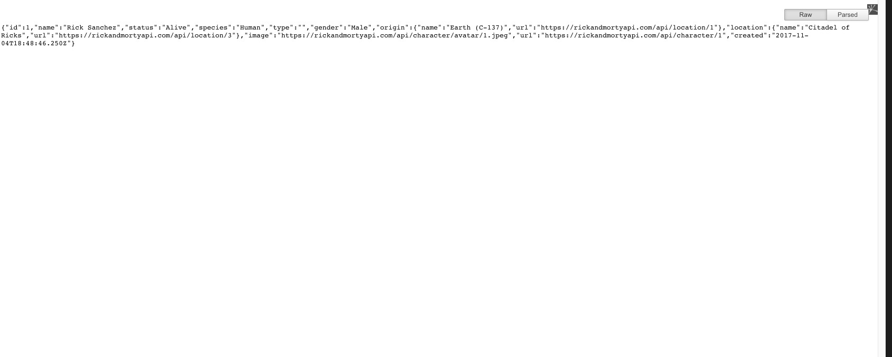

# Intro to Express

## What is a Backend

So far we've taught you a whole lot about building frontends for websites, but what does this elusive term "Backend" mean?

Before you actually code anything here, go ahead and visit this page in your browser [Rick an Morty API](https://rickandmortyapi.com/api/character). You should get a page that basically just looks like 

_pro tip_ if you want JSON data(which is what you're seeing) to look a bit nicer you can download an extension for your browser that will make it look nice. For me I use `JSON Formatter`.

As it turns out, this is the main purpose of most backends these days. They serve up some data that your website can use.

- This particular backend (we're going to call it an API for now) serves data about Rick and Morty Characters.
- Facebook's api will send data about what posts it should send its users
- Weather API's will send data about... you guessed it... the weather

## What is JSON

JSON, or Javascript Object Notation, is really just a **STRING** that can be turned into a javascript object.

_note: don't stress too much about commiting any of this part to memory, just want to give a rough idea of these terms for now so you can start to familiarize yourself with them_

For example:

```js
const person = JSON.parse('{"name": "jonathan"}'); // turn a JSON string into an object
```

will turn that string into this object

```js
const person = { name: "jonathan" };
```

It turns out this is EXTREMELY IMPORTANT because we ALWAYS SEND DATA OVER THE INTERNET AS STRINGS. Now we have a way to send complex types of data, but **ENCODE** them as a string.

## Let's Make a Rick and Morty Backend of Our Own

### Starting up your application

1. Installing dependencies

First we are going to need to install our dependencies. So after you clone this repository please cd into this repository and run:

```zsh
npm i # short for npm install
```

This will install all of the dependencies on your machine

2. Get the App started

in order to actually run our app we need to go into app.js and start it with some boilerplate code. (It's totally ok to just copy and paste this into app.js for now, but read the comments so you get an idea of what it's doing)

```js
let express = require("express"); // import the express package

let app = express(); // start your instance of the express application
app.listen(4000); // listen on port 4000 of your computer
```

now you should have all the peices in place to have an app running at the url `http://localhost:4000`

**Before you move on**, try visiting the url above in your browser and see what you find. You should get a "This site can't be reached" in your browser

### Starting Your Application

This one should be pretty easy, just go ahead in your terminal (make sure you are cd'd into this app), and run

```zsh
npm run start
```

You should see some stuff happen, then it will say 'starting `node app.js` somewhere. This means YOUR APP IS LIVE! Congratulations you've built your first express application! You are well on you're way to becoming Zuckerburg 2.0 🙂

Now go and visit that url again and you should see `Cannot GET /`. That is ok we're about to fix that!

### Making a Route

This is what express is for! Let's start by creating a hello world at the '/' route of our app.

In your app.js under everything you've written copy and paste the following code.

```js
/* 
This code says when a user visits the endpoint '/' on our url 
(which happens to be http://localhost:4000)
then the `res` will send out 'Hello World'
*/
app.get("/", (req, res) => {
  res.send("Hello World");
});
```

Now go into your browser and visit the url again. This time we should be able to see the beautiful words "Hello World". But what if we want to get something useful in there? Keep going to find out.

### Creating a '/characters' endpoint

in `data/characters.js` I've copied the data from that get request, that way we can make our own rick and morty backend.🙂

first lets import the characters array into our app.js file. Add this line to the top of your app

```js
const { characters } = require("./data/characters");
```

Then we need to create another endpoint, but this time instead of sending back 'hello world' we are just going to send back our characters array.

We also have to change the "/" to "/characters" so that way our app knows that if you go to `http://localhost:4000/` then we get the hello world message, but if you go to `http://localhost:4000/characters` then we get the characters array in JSON form. Let's add this to the end of our file

```js
app.get("/characters", (req, res) => {
  res.send(characters);
});
```

### Coding Challenge

The last thing we want to do is to show a specific character when we visit an endpoint for that character's id. For example if we visit `http://localhost:4000/characters/1` then we will see all of the data for a character with the id of `1`

```json
{
  "id": 1,
  "name": "Rick Sanchez",
  "status": "Alive",
  "species": "Human",
  "type": "",
  "gender": "Male",
  "origin": {
    "name": "Earth (C-137)",
    "url": "https://rickandmortyapi.com/api/location/1"
  },
  "location": {
    "name": "Citadel of Ricks",
    "url": "https://rickandmortyapi.com/api/location/3"
  },
  "image": "https://rickandmortyapi.com/api/character/avatar/1.jpeg",
  "url": "https://rickandmortyapi.com/api/character/1",
  "created": "2017-11-04T18:48:46.250Z"
}
```

to accomplish this I'm going to start you off with this code and let you figure out the rest

```js
app.get("/characters/:id", (req, res) => {
  console.log(req.params);
  const id = req.params.id;
  console.log(id);
  res.send("I'm what's going to send over");
});
```
